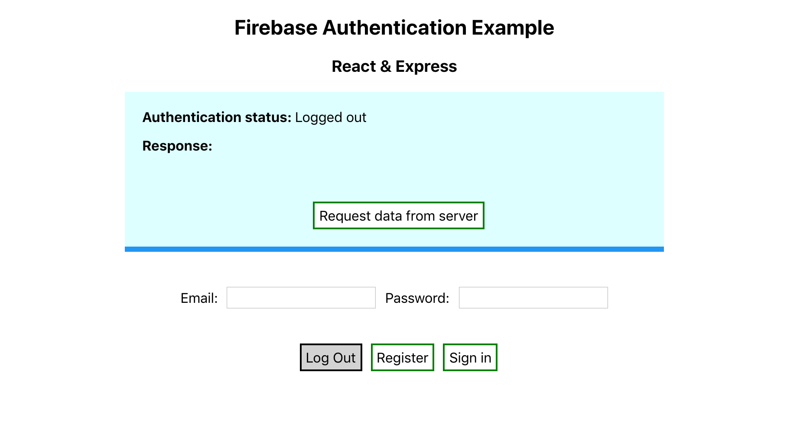

# 🔑 Firebase Authentication Example

An example app using Firebase authentication in React & Express.



## How to run

### Firebase

1. Set up a Firebase project at `https://console.firebase.google.com/`

2. Select `Authentication` from the left hand menu and enable `Email/Password`

### Client (React)

3.  Obtain the necessary client credentials from Firebase. On the left hand Firebase menu, click the ⚙️(settings icon), then select `Project Settings`. In the `Your apps` card, select a web app `</>`, provide an app nickname and then copy the generated credentials. The credentials should have the form:

```
  apiKey: "XXXX",
  authDomain: "XXXX",
  databaseURL: "XXXX",
  projectId: "XXXX",
  storageBucket: "XXXX",
  messagingSenderId: "XXXX",
  appId: "XXXX"
```

4. Create a new file named `firebaseConfig.js` in the `/client/src/config/` folder. Assign the credentials to a variable and export it as `firebaseConfig`. For example:

```
const firebaseConfig = {
  // credentials here!
};

export default firebaseConfig;
```

5. The file is imported in `/client/src/App.js` on line 7. If the above instructions are followed, there is no need to change this line.

6. Run the React app:

> > `npm install`

> > `npm start`

> > React app will be available on `localhost:3000`

### Server (Express)

7. Obtain the necessary server credentials from Firebase. On the left hand Firebase menu, click the ⚙️(settings icon), then select `Project Settings` and then the `Service accounts` tab. In the `Firebase Admin SDK` click to `Generate new private key`. The credentials should have the form:

```
{
  "type": "XXXX",
  "project_id": "XXXX",
  "private_key_id": "XXXX",
  "private_key": "XXXX",
  "client_email": "XXXX",
  "client_id": "XXXX",
  "auth_uri": "XXXX",
  "token_uri": "XXXX",
  "auth_provider_x509_cert_url": "XXXX",
  "client_x509_cert_url": "XXXX"
}
```

These credentials contain a private key that should be kept secret (i.e. not shared or committed to Git)

8. Create a file named `firebaseKey.json` in `/server/config/` and store the above credentials.

9. In `/server/server.js` the credentials are required on line 15. If the above instructions are followed, there is no need to change this line.

10. On line 20, the database URL will need to be updated. This URL will be available in the previously generated Firebase `Admin SDK configuration snippet`.

11. Run the server

> > `npm install`

> > `node server.js`

> > Server will run on `localhost:3001`

The server route '`/`' will not be accessible without authenticating.
